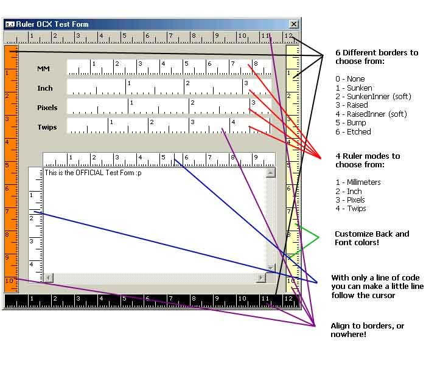



## MultiRuler OCX\!\!\!

### Description

I've been looking for this and found nothing so i started it myself, and here it is!

PS: Don't belive that, listen the actual story

I searched for something like this and only found a simple ruler. Only had the 4 modes thing, the orientation and the cursor-following lines. But it didn't work fine. So i fixed the orientation, added a code i found here to make it with borders (6 to choose from =] ), added back and font color stuff, and changed the code cause before it didn't remember and load settings if u used it in an app.

So, here it is, what YOU have been looking for too! The ruler OCX!

Comes with full source, a little example form (u can see it in the screenshot) and a little request:

Please if u make any changes, tell me, or send me it so i can have it to (i have an app using this ruler and it will be great to improve it)

If u want to vote, i'll be glad. that way more users will know about this and they can help with it too hehe =]

Maybe not the best control in the world, but it's useful.

Hope u like it!!
 
### More Info
 

             |
---                |---
**Submitted On**   |2002-08-18 22:04:22
**By**             |[Ignacio Nelson](https://github.com/Planet-Source-Code/PSCIndex/blob/master/ByAuthor/ignacio-nelson.md)
**Level**          |Intermediate
**User Rating**    |4.7 (75 globes from 16 users)
**Compatibility**  |VB 5\.0, VB 6\.0
**Category**       |[Custom Controls/ Forms/  Menus](https://github.com/Planet-Source-Code/PSCIndex/blob/master/ByCategory/custom-controls-forms-menus__1-4.md)
**World**          |[Visual Basic](https://github.com/Planet-Source-Code/PSCIndex/blob/master/ByWorld/visual-basic.md)
**Archive File**   |[MultiRuler1208228212002\.zip](https://github.com/Planet-Source-Code/ignacio-nelson-multiruler-ocx__1-38166/archive/master.zip)

